# ExpenseTracker

ExpenseTracker is a full-stack personal finance application for recording, organizing, and reviewing income, expenses, and investments.

**Live demo:** [my-expensetrackerapp.netlify.app](https://my-expensetrackerapp.netlify.app)

> Note: the backend runs on a free-tier server that sleeps after periods of inactivity. The first request after idle time may take 30–60 seconds to respond while the server wakes up.

## Project Overview

Managing personal finances is easier when transactions are organized, searchable, and visible in a single monthly view. ExpenseTracker provides a private workspace where each authenticated user can maintain categories, record financial activity, and review selected-period totals.

The project is intended for individuals who want a focused, browser-based way to track their personal financial activity. It also demonstrates a Django REST API integrated with a vanilla JavaScript frontend, JWT-based authentication, and a production deployment split across a managed database, an API host, and a static frontend host.

## Features

### Authentication

- User registration with username, email, password, and password confirmation.
- JWT-based sign-in using access and refresh tokens.
- Protected API endpoints and authenticated frontend pages.
- Automatic access-token renewal after an unauthorized API response when a valid refresh token is available.
- User-scoped categories and transactions.

### Finance Management

- Categories with fixed, variable, or one-time frequency.
- Transactions for income, expense, and investment activity.
- Transaction category, amount, date, and description fields.
- Category and transaction creation, editing, and deletion.
- Category search by name or frequency.
- Transaction search by category, type, or description.
- Paginated category and transaction lists.
- Month and year filtering for transactions.
- Dashboard totals for income, expenses, investments, and net balance.
- Bar chart comparing selected-period income, expenses, and investments.
- Pending labels for future-dated expenses on the dashboard.

### User Experience

- Responsive sidebar navigation on desktop and bottom navigation on smaller screens.
- Light and dark theme toggle with persisted preference.
- Skeleton rows and chart placeholders while dashboard and table data loads.
- Toast notifications for successful actions and request errors.
- Custom keyboard-accessible confirmation modal for deletions.
- Contextual empty states for category and transaction tables.
- Installable as a Progressive Web App (PWA) — can be added to the home screen on iOS or installed as a desktop app from the browser, with a custom icon and full-screen standalone display.

## Tech Stack

| Area | Technologies |
| --- | --- |
| Backend | Python, Django, Django REST Framework |
| Frontend | HTML5, CSS3, Vanilla JavaScript (ES modules) |
| Database | PostgreSQL (Neon) in production; SQLite supported for local development |
| Authentication | JSON Web Tokens via `djangorestframework-simplejwt` |
| Charts | Chart.js |
| Deployment | Render (backend/API), Neon (managed PostgreSQL), Netlify (static frontend) |
| Other | Gunicorn (WSGI server), Whitenoise (static file serving), CORS middleware, PWA (Web App Manifest) |

## Project Structure

```text
ExpenseTracker/
├── backend/
│   └── expensetracker/
│       ├── expensetracker/       # Django configuration, routing, WSGI, and ASGI entry points
│       ├── finance/              # Models, serializers, views, pagination, and migrations
│       ├── api_tests.http        # Example HTTP requests for the API
│       └── manage.py             # Django management command entry point
├── frontend/
│   ├── css/                      # Shared, responsive, and page-specific styles
│   ├── js/                       # API, authentication, dashboard, form, and UI helpers
│   ├── icons/                    # PWA icons (192px, 512px, Apple touch icon)
│   ├── manifest.json             # PWA web app manifest
│   ├── dashboard.html            # Dashboard page
│   ├── categories.html           # Category management page
│   ├── transactions.html         # Transaction management page
│   ├── index.html                # Sign-in page
│   └── register.html             # Registration page
├── docs/                         # Project documentation
├── requirements.txt              # Python dependencies
└── README.md
```

## Screenshots

### Dashboard

<p align="center">
  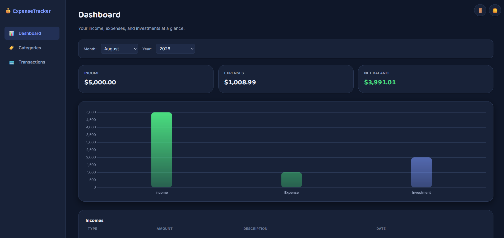
  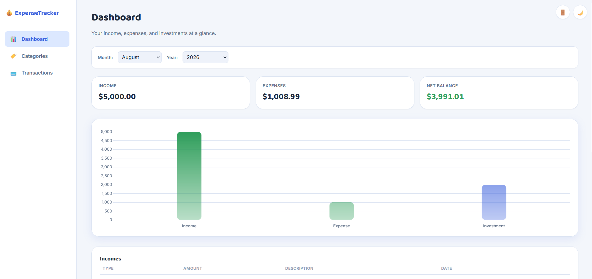
  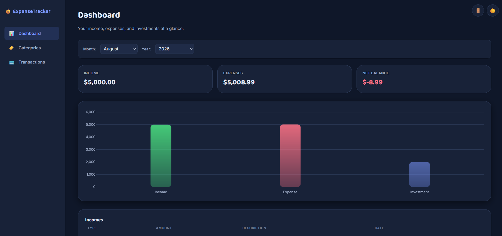
  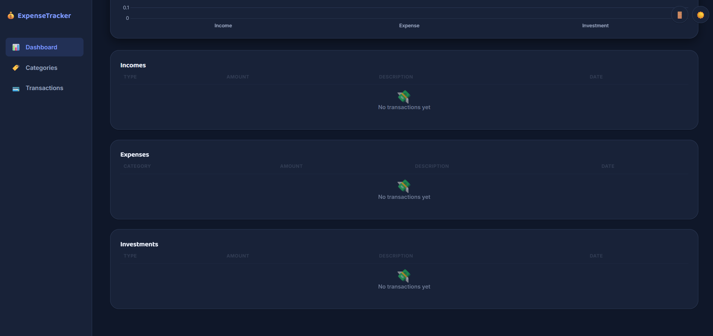
</p>

---

### Transactions

<p align="center">
  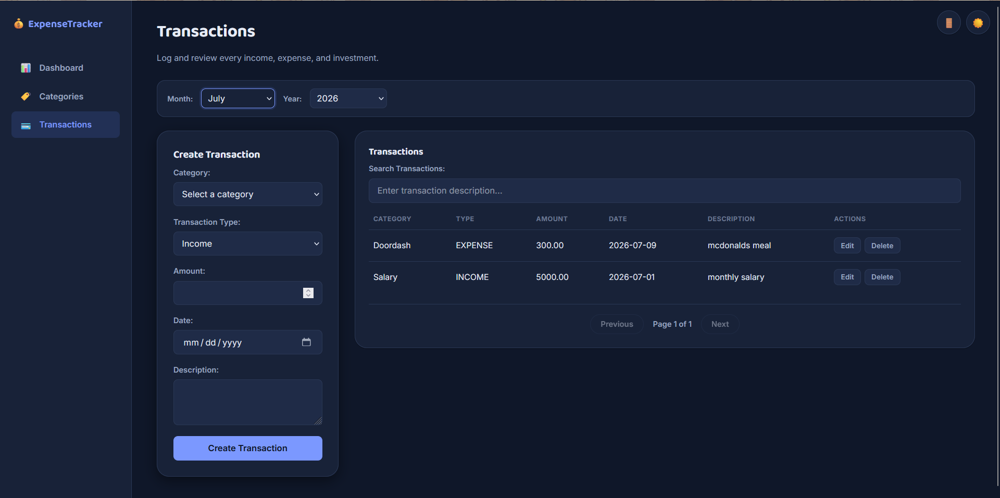
  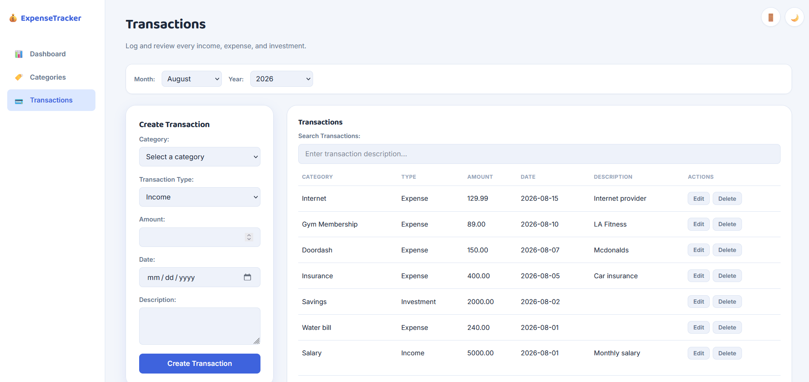
  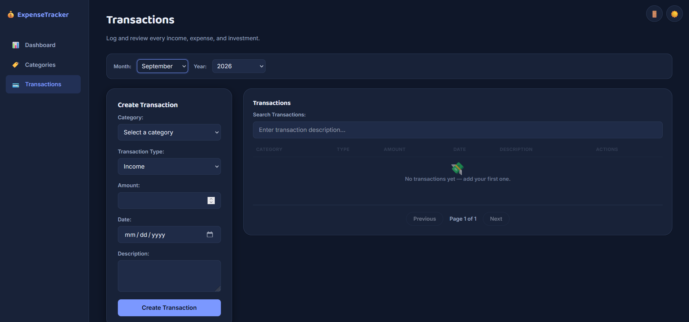
</p>

---

### Categories

<p align="center">
  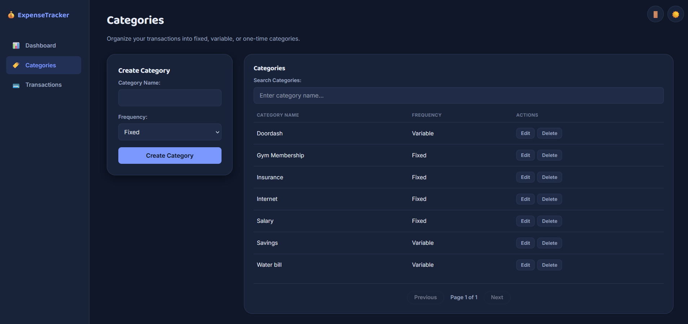
  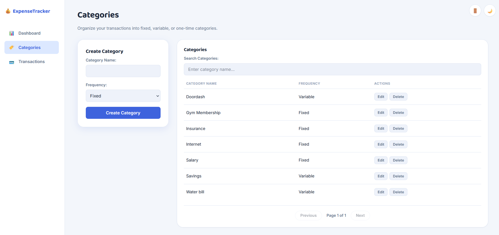
</p>

---

### Login

<p align="center">
  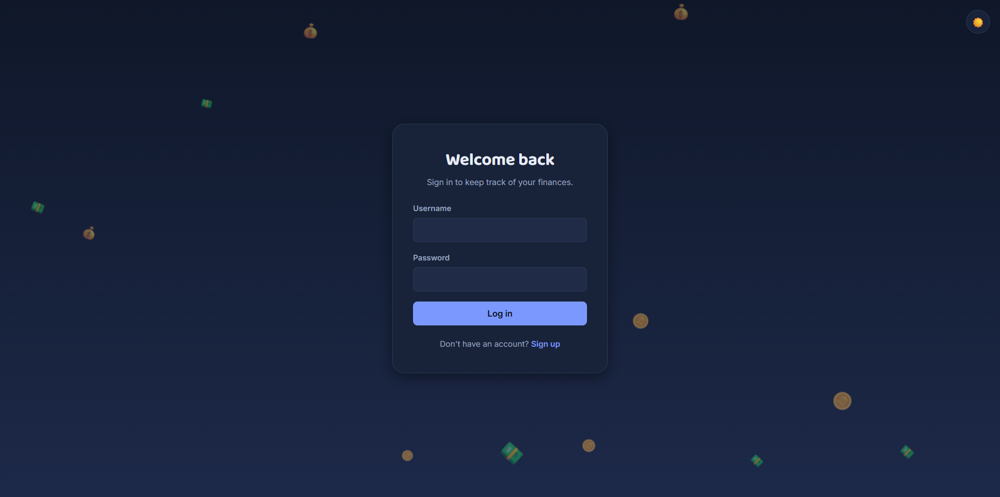
  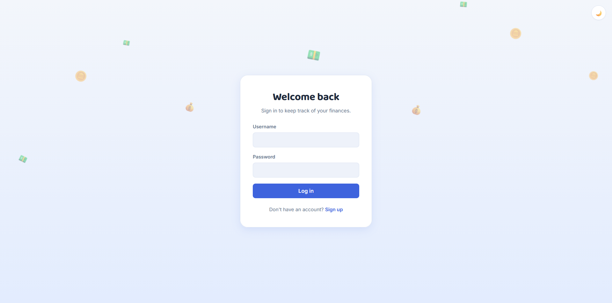
</p>

---

### Register

<p align="center">
  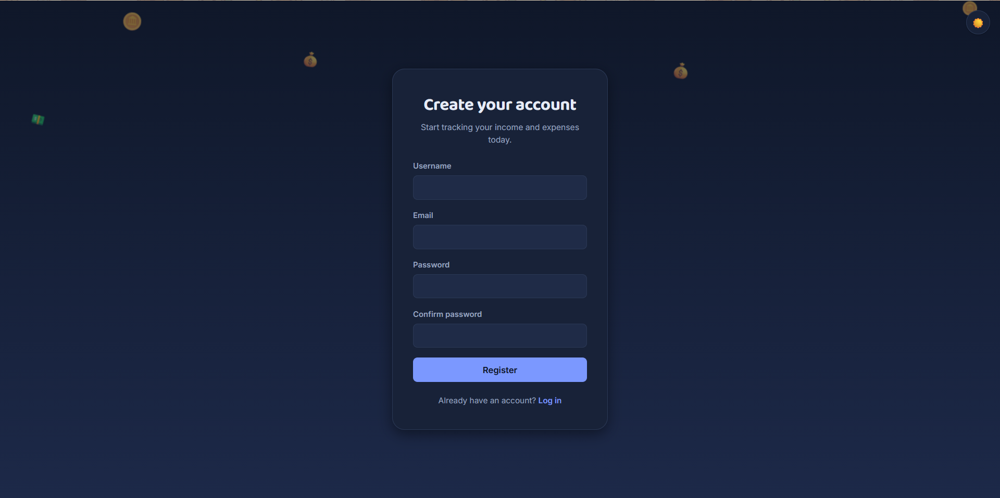
  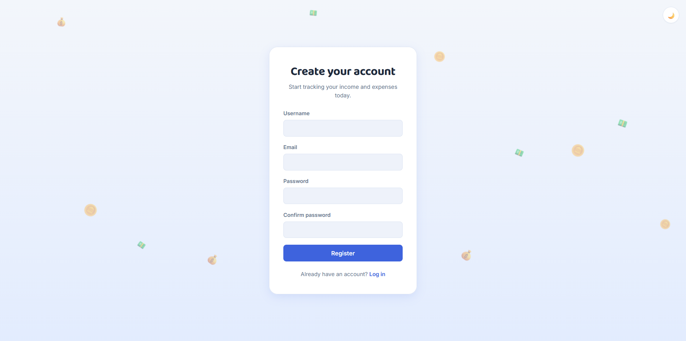
</p>

---

### Mobile

<p align="center">
  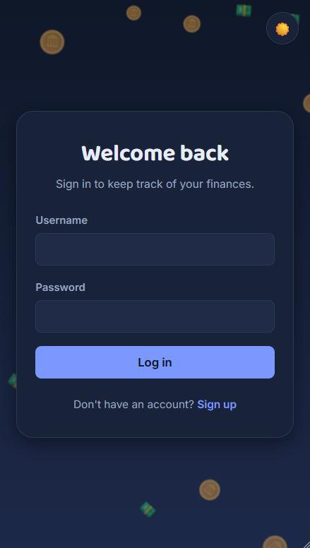
  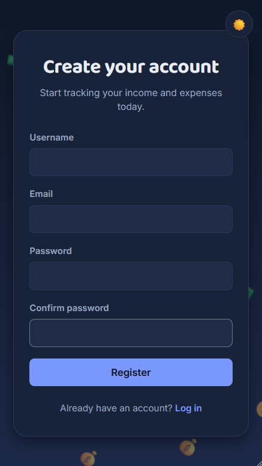
  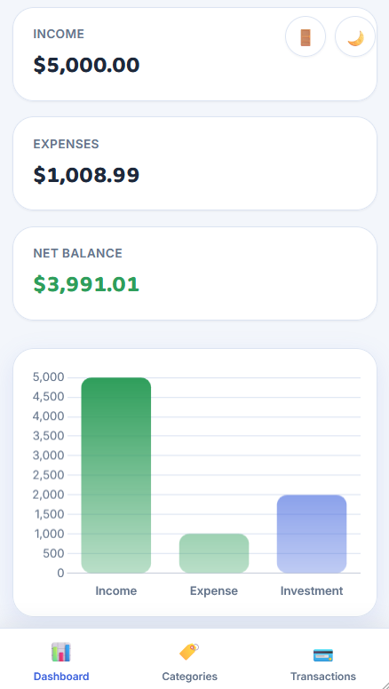
  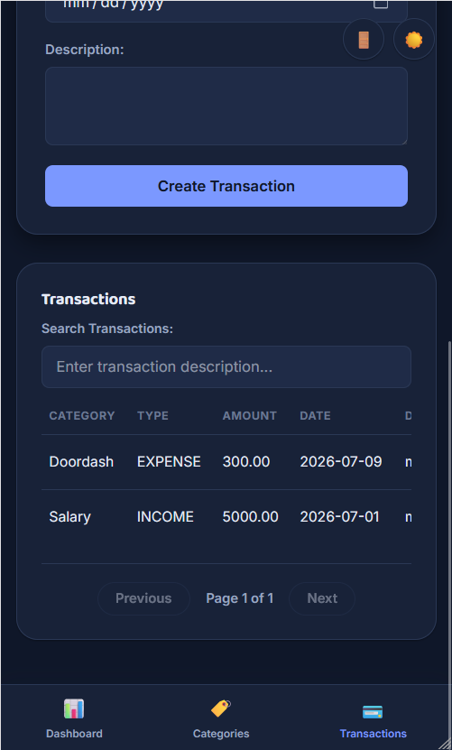
  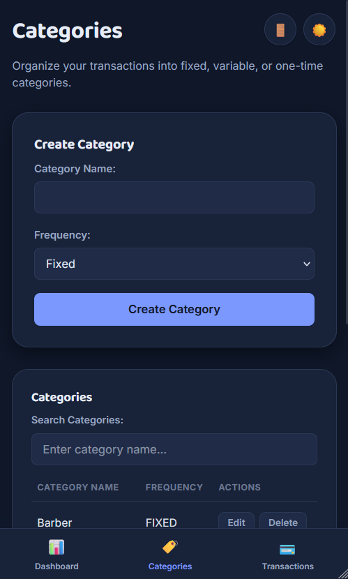
</p>

## Deployment

The application is deployed across three free-tier services:

| Layer | Service | Notes |
| --- | --- | --- |
| Database | [Neon](https://neon.tech) | Managed PostgreSQL. Compute auto-suspends after inactivity and resumes automatically on the next query — no manual maintenance required. |
| Backend / API | [Render](https://render.com) | Django app served with Gunicorn. Free-tier web services sleep after ~15 minutes of inactivity; the first request afterward is slower while the service wakes up. |
| Frontend | [Netlify](https://netlify.com) | Static hosting for the HTML/CSS/JS frontend, deployed from this repository. |

Configuration is environment-based (see below), so the same codebase runs locally against SQLite or in production against the hosted PostgreSQL database without code changes.

## Installation

### Prerequisites

- Python 3.12 or later
- A modern web browser
- A static web server for the frontend, such as VS Code Live Server

### 1. Clone the repository

```bash
git clone <repository-url>
cd ExpenseTracker
```

### 2. Create and activate a virtual environment

**Windows (PowerShell)**

```powershell
python -m venv venv
.\venv\Scripts\Activate.ps1
```

**macOS/Linux**

```bash
python3 -m venv venv
source venv/bin/activate
```

### 3. Install backend dependencies

```bash
pip install -r requirements.txt
```

### 4. Required Environment Variables

The Django settings module reads configuration from environment variables via a `.env` file. Create `backend/expensetracker/.env`:

```env
SECRET_KEY=replace-with-a-long-random-secret-key
DEBUG=True
DATABASE_URL=sqlite:///db.sqlite3
ALLOWED_HOSTS=127.0.0.1,localhost
CORS_ALLOWED_ORIGINS=http://127.0.0.1:5500
```

To generate a development secret key:

```bash
python -c "import secrets; print(secrets.token_urlsafe(50))"
```

For a production-style setup, set `DATABASE_URL` to a PostgreSQL connection string (e.g. from Neon) instead of the SQLite URL, and set `DEBUG=False`.

| Variable | Description |
| --- | --- |
| `SECRET_KEY` | Django's cryptographic signing key. |
| `DEBUG` | Enables/disables debug mode. Should be `False` in production. |
| `DATABASE_URL` | Database connection string, parsed via `dj-database-url`. Supports SQLite (local) or PostgreSQL (production). |
| `ALLOWED_HOSTS` | Comma-separated list of hostnames the Django app will serve. |
| `CORS_ALLOWED_ORIGINS` | Comma-separated list of frontend origins allowed to call the API. |

## Running Locally

### Backend

From the Django project directory, apply migrations and start the API server:

```bash
cd backend/expensetracker
python manage.py migrate
python manage.py runserver
```

The backend runs at `http://127.0.0.1:8000`.

### Create a Superuser

From `backend/expensetracker`, run:

```bash
python manage.py createsuperuser
```

The Django admin is available at `http://127.0.0.1:8000/admin/`.

### Frontend

Serve the `frontend` directory at `http://127.0.0.1:5500`. For example, use VS Code Live Server configured to use port `5500`, then open:

```text
http://127.0.0.1:5500/index.html
```

The backend permits this frontend origin through `CORS_ALLOWED_ORIGINS` by default. If a different host or port is used, update the `.env` file accordingly.

### Running Both Servers

Keep the Django server running in one terminal and the frontend static server running in another. Register a user, sign in, create categories, and then add transactions.

## Authentication

1. The login form sends credentials to `POST /api/token/`.
2. The API returns an access token and a refresh token.
3. The frontend stores both tokens in browser `localStorage` and attaches the access token as `Authorization: Bearer <access_token>` to API requests.
4. If a request returns `401 Unauthorized`, the frontend posts the refresh token to `POST /api/token/refresh/`.
5. When refresh succeeds, the frontend stores the replacement access token and retries the original request once. If it fails, the stored tokens are removed and the user is redirected to the login page.

The backend restricts category and transaction querysets to the authenticated user. It also rejects transactions that reference a category owned by another user.

## API Overview

Local base URL: `http://127.0.0.1:8000/api`
Production base URL: the deployed Render service URL, configured in the frontend's `api.js`.

### Authentication

| Method | Endpoint | Authentication | Description |
| --- | --- | --- | --- |
| `POST` | `/token/` | No | Obtain access and refresh tokens with username and password. |
| `POST` | `/token/refresh/` | No | Obtain a new access token from a refresh token. |

### Users

| Method | Endpoint | Authentication | Description |
| --- | --- | --- | --- |
| `POST` | `/register/` | No | Create a user with username, email, password, and password confirmation. |
| `GET` | `/secret/` | Required | Return a protected sample response for the authenticated user. |

### Categories

| Method | Endpoint | Authentication | Description |
| --- | --- | --- | --- |
| `GET`, `POST` | `/categories/` | Required | List or create the current user's categories. Supports `page`, `page_size`, and `search` query parameters. |
| `GET`, `PUT`, `PATCH`, `DELETE` | `/categories/{id}/` | Required | Retrieve, update, or delete a current-user category. |

### Transactions

| Method | Endpoint | Authentication | Description |
| --- | --- | --- | --- |
| `GET`, `POST` | `/transactions/` | Required | List or create the current user's transactions. Supports `page`, `page_size`, `month`, `year`, and `search` query parameters. |
| `GET`, `PUT`, `PATCH`, `DELETE` | `/transactions/{id}/` | Required | Retrieve, update, or delete a current-user transaction. |

### Dashboard

The dashboard uses the transactions collection endpoint with the selected `month` and `year`, requesting up to 1,000 records. It calculates totals and renders the chart in the frontend; there is no separate dashboard API endpoint.

## Design Highlights

- Responsive application shell that changes from a desktop sidebar to mobile bottom navigation.
- Theme-aware interface with persisted light and dark preferences.
- Loading skeletons to avoid empty table and chart areas during requests.
- Non-blocking toast feedback for success and error states.
- Custom confirmation modal that supports keyboard dismissal and focus containment.
- Empty-state messaging and paginated data tables for easier browsing.
- Installable PWA with a custom app icon for a native-like experience on mobile and desktop.

## License

MIT License.

## Author

**Lucas Machado de Almeida**
[LinkedIn](https://www.linkedin.com/in/lucmachado/)